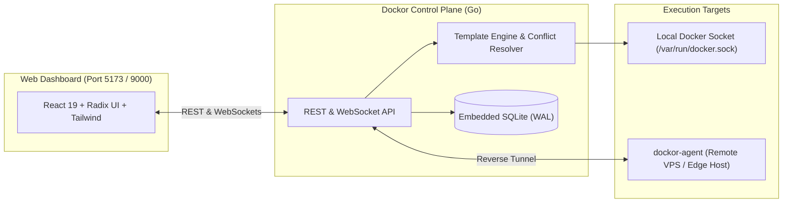

# Dockor

<div align="center">

**Modern, lightweight container and dynamic application template management platform.**

*A high-performance, single-binary container and application stack manager with first-class template ergonomics, automatic port collision resolution, and zero external database dependencies.*

[](https://golang.org)
[](https://react.dev)
[](LICENSE)

</div>

---

## Key Differentiators

- **Dynamic Template Engine**: Deploy multi-container stacks with auto-generated passwords (`random_string`, `uuid`), port collision scanning, and schema-driven input forms.
- **Universal Template Compatibility**: Direct ingestion adapter for standard community `templates-2.0.json` catalogs.
- **Zero-Dependency Core**: Single Go binary powered by pure-Go embedded SQLite (`modernc.org/sqlite` in WAL mode) — no PostgreSQL or Redis required.
- **Modern Operator Interface**: High-density dark-mode UI built with React 19, Radix UI primitives, Tailwind CSS, and Monaco Editor.
- **Outbound Reverse-Tunnel Agent**: Manage remote Docker hosts behind NAT and firewalls using the lightweight Go daemon (`dockor-agent`) without exposing Docker sockets.

---

## Architecture Overview



---

## Quick Start

### 1. Run with Docker Compose

```bash
# Clone the repository
git clone https://github.com/pilotworks/dockor.git
cd dockor

# Start Dockor
docker compose up -d
```

Open your browser at **`http://localhost:9000`**.

---

### 2. Local Development

#### Prerequisites
- **Go** >= 1.24
- **Node.js** >= 20 & **pnpm**
- **Docker Engine** running locally

#### Running the Backend:
```bash
# Run Go server
go run ./cmd/dockor
```
The backend initializes SQLite in `./data/dockor.db` and loads starter templates from `./templates`.

#### Running the Frontend:
```bash
cd web
pnpm install
pnpm dev
```
The React development server runs at **`http://localhost:5173`** with hot module replacement and proxies `/api` requests to the Go backend.

---

## Template Specification Example

Templates are declared via `dockor.yaml` with rich variable schemas:

```yaml
metadata:
  id: "nextcloud"
  name: "Nextcloud Hub"
  version: "28.0.4"
  category: "Productivity"

variables:
  - name: APP_PORT
    label: "Web Interface Port"
    type: "port"
    default: 8080
    required: true
    port_config:
      auto_resolve_conflict: true  # Automatically increments if 8080 is busy!

  - name: MYSQL_ROOT_PASSWORD
    label: "Database Root Password"
    type: "secret"
    generator: "random_string(32, charset=alphanumeric)"
    required: true
    hidden: true
```

---

## Documentation Suite

Detailed architecture specifications are located in the [`docs/`](docs) directory:

- [**Architecture & System Design**](docs/architecture.md)
- [**Template Specification**](docs/template-spec.md)
- [**Remote Node Agent Protocol Specification**](docs/agent-protocol-spec.md)
- [**REST & WebSocket API Specification**](docs/api-spec.md)
- [**Features & Strategic Roadmap**](docs/roadmap-and-features.md)
- [**Deployment & Security Model**](docs/deployment-and-security.md)

---

## License

Licensed under the **Apache License 2.0**.
