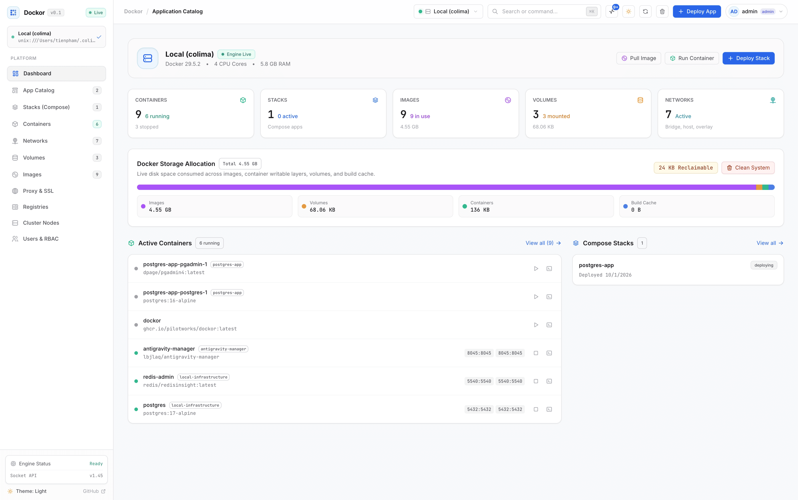
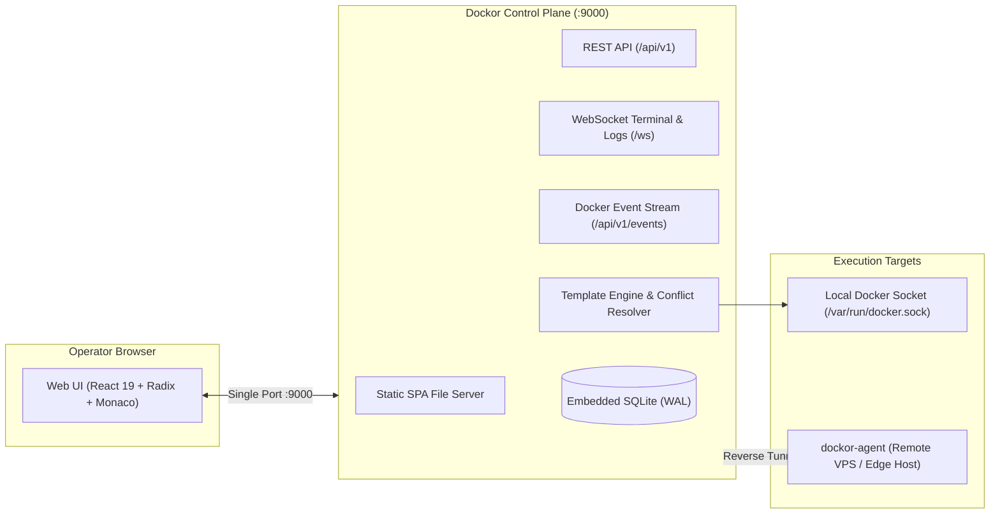

<div align="center">


# Dockor

**Modern, lightweight container and dynamic application template management platform.**

*A high-performance, single-binary container and application stack manager with unified single-port architecture, first-class template ergonomics, automatic port collision resolution, and zero external database dependencies.*

[](https://golang.org)
[](https://react.dev)
[](.github/workflows/ci.yml)
[](.github/workflows/release.yml)
[](LICENSE)

<br />
<br />



</div>

---

## Key Features

- **Unified Single-Port Architecture**: Web Dashboard, REST API, interactive WebSocket TTY, and real-time SSE Docker event stream are served on a single port (`:9000`).
- **Integrated Reverse Proxy & Automated SSL**: Embedded Caddy module providing zero-touch Let's Encrypt / ZeroSSL HTTPS certificates, custom domain routing, and zero-downtime hot reloading.
- **Split-View Visualizer for Compose**: Interactive two-way real-time synchronization between visual service cards form and Monaco YAML editor.
- **Dynamic Template Engine**: Deploy multi-container stacks with auto-generated credentials (`random_string`, `uuid`), intelligent port collision scanning, and schema-driven input forms.
- **Universal Template Compatibility**: Native ingestion adapter for community `templates-2.0.json` catalogs.
- **Container File Manager**: In-browser directory traversal, preview and edit configuration files directly with Monaco Editor, file upload, download, and deletion.
- **Logs Stream Pro**: Real-time log streaming with keyword search, regex filtering, severity filters (`All`, `Error`, `Warn`, `Info`), file export (`.log`), and line-wrap controls.
- **Encrypted Registry Manager**: Dedicated management for Docker Hub, GHCR, GitLab, Quay, and private registries. All credentials are encrypted at rest with **AES-256-GCM** using an isolated master key separated from the database.
- **Command Palette (`⌘K` / `Ctrl+K`)**: Instant search and rapid actions across containers, compose stacks, images, volumes, networks, and templates.
- **Real-Time Docker Event Stream & Activity Drawer**: Live daemon telemetry via Server-Sent Events (SSE), automatic cache invalidation, and instant alerting on container crashes or OOM events.
- **Zero-Dependency Core**: Single Go binary powered by embedded SQLite in WAL mode (`modernc.org/sqlite`) — zero external database dependencies.
- **Outbound Reverse-Tunnel Agent**: Manage remote Docker hosts behind NAT and firewalls using the lightweight daemon (`dockor-agent`) without exposing Docker daemon sockets.

---

## Architecture Overview



---

## Quick Start

### 1. Run with Docker Compose (Recommended)

Dockor runs as a single container serving both the web interface and the backend API on port `9000`:

```bash
# Clone the repository
git clone https://github.com/pilotworks/dockor.git
cd dockor

# Launch with Docker Compose
docker compose up -d
```

Open your browser at **`http://localhost:9000`**.

#### `docker-compose.yml` Example:

```yaml
services:
  dockor:
    image: dockor:latest
    build:
      context: .
      dockerfile: Dockerfile
    container_name: dockor
    restart: unless-stopped
    ports:
      - "9000:9000"
    environment:
      - DOCKOR_PORT=9000
      - DOCKOR_DATA_DIR=/app/data
      - DOCKOR_TEMPLATES_DIR=/app/templates
      - DOCKOR_WEB_DIR=/app/web/dist
      - DOCKER_HOST=unix:///var/run/docker.sock
    volumes:
      - /var/run/docker.sock:/var/run/docker.sock
      - dockor_data:/app/data
    healthcheck:
      test: ["CMD-SHELL", "curl -f http://localhost:9000/api/v1/health || exit 1"]
      interval: 15s
      timeout: 5s
      retries: 3

volumes:
  dockor_data:
```

---

### 2. Local Development

#### Prerequisites
- **Go** >= 1.24
- **Bun** >= 1.0
- **Docker Engine** running locally

#### Running the Backend:
```bash
# Start Go server
go run ./cmd/dockor
```
The backend initializes SQLite in `./data/dockor.db`, generates master encryption keys in `./data/dockor.secret.key`, and serves both the API and the web UI (if built) on `http://localhost:9000`.

#### Running the Frontend (Hot-Reload Mode):
```bash
cd web
bun install
bun run dev
```
The Vite development server runs at **`http://localhost:5173`** with hot module replacement and proxies API/WebSocket calls to the Go backend on port 9000.

#### Building All Production Artifacts:
```bash
# Build frontend and compile backend binaries into ./bin
make build
```

---

## Template Specification Example

Templates are declared via `dockor.yaml` with rich variable schemas:

```yaml
metadata:
  id: "nextcloud"
  name: "Nextcloud Hub"
  version: "28.0.4"
  category: "Productivity"

variables:
  - name: APP_PORT
    label: "Web Interface Port"
    type: "port"
    default: 8080
    required: true
    port_config:
      auto_resolve_conflict: true  # Automatically scans and increments if 8080 is occupied

  - name: MYSQL_ROOT_PASSWORD
    label: "Database Root Password"
    type: "secret"
    generator: "random_string(32, charset=alphanumeric)"
    required: true
    hidden: true
```

---

## Security & Credential Storage

Dockor implements strict hardware-grade encryption for sensitive data:
- **AES-256-GCM Encryption**: All registry passwords, access tokens, and private keys are encrypted prior to database insertion.
- **Isolated Key Separation**: The encryption key is loaded from the `DOCKOR_SECRET_KEY` environment variable or auto-generated into a dedicated file (`data/dockor.secret.key`) with strict `0600` permissions, ensuring keys are isolated from database backups and dumps.

---

## CI/CD & Automated Releases

Dockor uses **Google Release Please** (`googleapis/release-please-action`) alongside GitHub Actions:
- **Continuous Integration (`ci.yml`)**: Runs on all pushes and PRs, executing TypeScript checking, frontend builds, Go unit tests with race detection, and Docker build smoke tests.
- **Automated Releases (`release.yml`)**: Follows Conventional Commits to automatically open release PRs, bump semantic versions, generate `CHANGELOG.md`, compile multi-platform binaries (`linux/amd64`, `linux/arm64`, `darwin/amd64`, `darwin/arm64`, `windows/amd64`), and publish multi-arch Docker images to GitHub Container Registry (`ghcr.io`).

---

## Documentation Suite

Detailed architecture specifications are located in the [`docs/`](docs) directory:

- [**Architecture & System Design**](docs/architecture.md)
- [**Template Specification**](docs/template-spec.md)
- [**Remote Node Agent Protocol Specification**](docs/agent-protocol-spec.md)
- [**REST & WebSocket API Specification**](docs/api-spec.md)
- [**Features & Strategic Roadmap**](docs/roadmap-and-features.md)
- [**Deployment & Security Model**](docs/deployment-and-security.md)

---

## License

Licensed under the **Apache License 2.0**.
