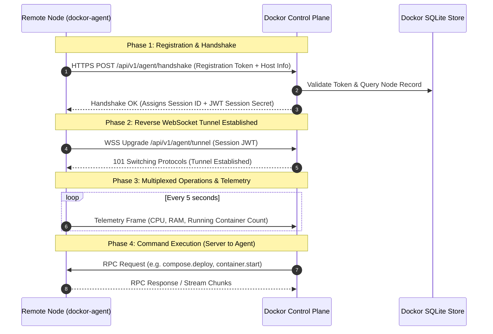

# Remote Node Agent Protocol Specification

## 1. Overview & Objectives

The **Dockor Remote Node Agent** (`dockor-agent`) is a lightweight, zero-dependency Go daemon designed to run on remote Docker hosts. It connects back to the centralized Dockor control plane using an **outbound-only secure reverse tunnel**, eliminating the need to expose Docker sockets over the public internet, open firewall ports, or manage manual TLS certificates.

### Key Characteristics:
- **Zero Inbound Ports**: Agent establishes an outbound TLS connection over port 443/8443 to the Dockor server.
- **Resource Efficient**: Static Go binary (< 15MB) consuming < 20MB of RAM.
- **Multiplexed Communications**: Single TCP connection carries RPC commands, continuous health telemetry, real-time log streams, and interactive terminal PTY sessions.
- **NAT & Firewall Traversal**: Functions transparently behind residential NATs, corporate firewalls, and cloud VPCs.

---

## 2. Architecture & Connection Model



---

## 3. Wire Protocol & Framing

The reverse tunnel operates over WebSocket binary frames. Each frame is prefixed with a 9-byte binary header followed by the payload to support stream multiplexing:

### 3.1 Binary Frame Header

```
 0                   1                   2                   3
 0 1 2 3 4 5 6 7 8 9 0 1 2 3 4 5 6 7 8 9 0 1 2 3 4 5 6 7 8 9 0 1
+-+-+-+-+-+-+-+-+-+-+-+-+-+-+-+-+-+-+-+-+-+-+-+-+-+-+-+-+-+-+-+-+
|  Version (1)  |   StreamType  |           Flags (16)          |
+-+-+-+-+-+-+-+-+-+-+-+-+-+-+-+-+-+-+-+-+-+-+-+-+-+-+-+-+-+-+-+-+
|                          Stream ID (32)                       |
+-+-+-+-+-+-+-+-+-+-+-+-+-+-+-+-+-+-+-+-+-+-+-+-+-+-+-+-+-+-+-+-+
|  Payload ...                                                  |
+-+-+-+-+-+-+-+-+-+-+-+-+-+-+-+-+-+-+-+-+-+-+-+-+-+-+-+-+-+-+-+-+
```

| Field | Type | Description |
| :--- | :--- | :--- |
| **Version** | `uint8` | Protocol version (currently `0x01`). |
| **StreamType** | `uint8` | Defines channel purpose: `0x01` (Control/RPC), `0x02` (Telemetry), `0x03` (Container Logs), `0x04` (TTY Exec/Terminal). |
| **Flags** | `uint16` | Bitmask: `0x0001` (SYN - Open stream), `0x0002` (FIN - Close stream), `0x0004` (RST - Abort stream). |
| **Stream ID** | `uint32` | Unique identifier for multiplexed sessions on the same tunnel. |
| **Payload** | `[]byte` | Message body (JSON-encoded for RPC/Telemetry, raw binary for Terminal/Logs). |

---

## 4. Message Schemas

### 4.1 Agent Handshake Request (`POST /api/v1/agent/handshake`)

```json
{
  "enrollment_token": "dck_enroll_9a8f2c3d4e5f6a7b8c9d0e1f",
  "hostname": "vps-lon-01.infra.internal",
  "agent_version": "1.0.0",
  "os": "linux",
  "arch": "amd64",
  "docker_version": "26.1.1",
  "total_memory_bytes": 17179869184,
  "cpu_cores": 4
}
```

### 4.2 Handshake Response

```json
{
  "node_id": "node_01hvy9f5z3w7a1b2c3d4e5f6",
  "session_token": "eyJhbGciOiJIUzI1NiIsInR5cCI6IkpXVCJ9...",
  "tunnel_endpoint": "wss://dockor.example.com/api/v1/agent/tunnel",
  "heartbeat_interval_sec": 5
}
```

### 4.3 Control & RPC Messages (StreamType: `0x01`)

The Control channel uses standard JSON-RPC 2.0 semantics:

#### Deploy Stack Request:
```json
{
  "jsonrpc": "2.0",
  "id": "req-10492",
  "method": "stack.deploy",
  "params": {
    "stack_name": "production-analytics",
    "compose_yaml": "version: '3.8'\nservices:\n  plausible:\n    image: plausible/analytics:latest...",
    "env_vars": {
      "BASE_URL": "https://stats.example.com"
    },
    "pull_latest": true
  }
}
```

#### Stream Log Output:
```json
{
  "jsonrpc": "2.0",
  "method": "stack.deploy.progress",
  "params": {
    "step": "pulling_images",
    "service": "plausible",
    "status": "Downloading layer 4f4fb700ef54 [==>       ] 12.4MB/45.2MB"
  }
}
```

---

## 5. Terminal & Exec Hijacking (StreamType: `0x04`)

When an operator launches an interactive terminal on a remote container:
1. Dockor Server assigns a new `Stream ID` (e.g., `0x00000042`) and sends an RPC command: `container.exec_start` with `tty: true`, `cols: 120`, `rows: 30`.
2. Agent executes `ContainerExecCreate` and `ContainerExecAttach` via the local Docker socket.
3. Keystrokes sent from the user's browser are packaged into binary frames (`StreamType = 0x04, Stream ID = 0x00000042`) and delivered directly to the container's stdin.
4. Terminal output is streamed back over the same `Stream ID` to xterm.js in the browser.
5. Window resize events (`SIGWINCH`) are transmitted as Control frames to keep the remote PTY dimensions synchronized.

---

## 6. Liveness, Reconnection & Failure Recovery

- **Heartbeat & Dead Peer Detection**: The Agent transmits a periodic ping every 5 seconds. If the Server receives no frames for 15 seconds, the node status is marked `DISCONNECTED` and alerts are triggered.
- **Exponential Backoff**: If the agent loses connection, it retries connecting automatically:
  $$\text{Delay} = \min(60\text{s}, 2^n \times 1\text{s}) + \text{jitter}(0, 1000\text{ms})$$
- **Autonomous Local Operation**: If the tunnel disconnects, containers running on the remote node continue running undisturbed. The agent queues pending alerts locally and flushes them once reconnected.

---

## 7. One-Line Agent Installation

A bootstrap script generates a registration command directly from the Dockor UI:

```bash
curl -fsSL https://dockor.example.com/install-agent.sh | sudo sh -s -- \
  --server https://dockor.example.com \
  --token dck_enroll_9a8f2c3d4e5f6a7b8c9d0e1f
```

The script:
1. Downloads the appropriate architecture binary (`linux-amd64` / `linux-arm64`).
2. Generates a `/etc/dockor/agent.yaml` configuration.
3. Installs and starts a systemd service (`dockor-agent.service`) with auto-restart on boot.
