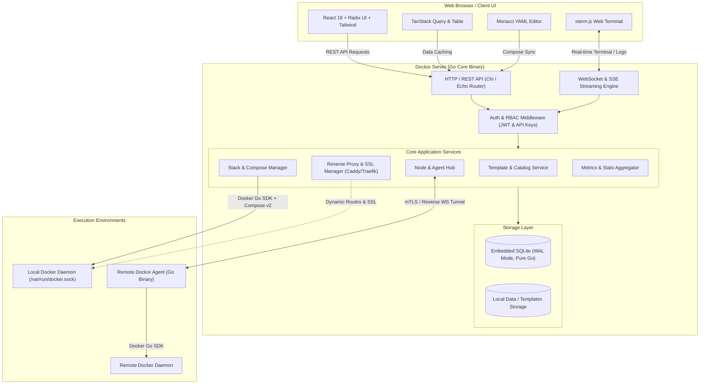
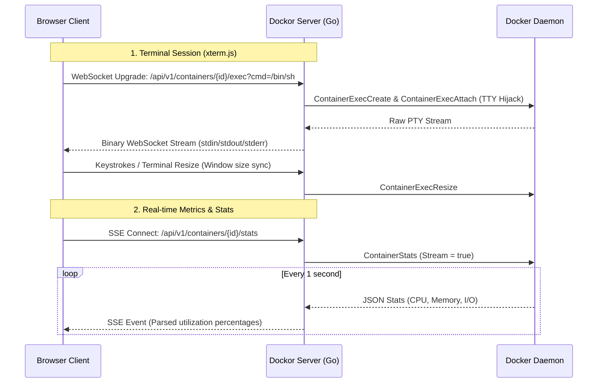

# Architecture & System Design

## 1. Overview & Philosophy

**Dockor** is a modern, lightweight, single-binary container and application template management platform. Designed as a next-generation alternative to Portainer, Dockor emphasizes:

- **Template-First Ergonomics**: Composable, versioned application stacks with dynamic input forms, secret generation, and automatic port conflict resolution.
- **Minimal Footprint & Zero Dependencies**: Built with Go and embedded pure-Go SQLite; no external databases (Postgres/Redis) required for single-node deployments.
- **Developer-Centric UX**: Clean, high-density interface built on React, Radix UI primitives, and Tailwind CSS, featuring Monaco Editor for Compose files and xterm.js for streaming terminal sessions.
- **Node-Agnostic Core**: Uniform interface for managing local Docker daemons and remote nodes via a lightweight reverse-tunneling agent.

---

## 2. High-Level Architecture



---

## 3. Backend Architecture (Go)

The Dockor backend is written in Go to maximize concurrency, minimize runtime memory consumption (~30-50MB RSS), and produce static, self-contained binaries.

### 3.1 Layered Architecture

```
cmd/
  dockor/               # Server entrypoint
  dockor-agent/         # Remote node agent entrypoint
internal/
  api/
    handlers/           # HTTP and WebSocket endpoint handlers
    middleware/         # Auth, logging, rate limiting, CORS
    router.go           # Route registration and WebSocket upgrades
  catalog/              # Git catalog syncing, template parsing & validation
  compose/              # Docker Compose v2 programmatic wrapper
  config/               # Application configuration and environment flags
  docker/               # Docker Engine client abstraction and socket handlers
  models/               # Domain models and DTOs
  proxy/                # Dynamic reverse proxy engine (Caddy embedded/manager)
  repository/           # SQLite data access layer
  service/              # Core business logic (stacks, templates, users, nodes)
  tunnel/               # WebSocket multiplexing and agent connection manager
pkg/
  schema/               # JSON Schema and template definitions
```

### 3.2 Docker Engine & Compose Integration

Dockor avoids shelling out raw bash commands for container lifecycle operations:
1. **Direct Docker Engine API**: Interacts with the Docker socket (`unix:///var/run/docker.sock` or Windows named pipe) using official `github.com/docker/docker/client`.
2. **Programmatic Compose v2**: Leverages Docker Compose v2 Go packages (`github.com/docker/compose/v2/pkg/api`) to parse, validate, interpolate variables, and orchestrate multi-container stacks without spawning external sub-processes.
3. **Stream Multiplexing**: Docker log streams (stdout/stderr) and terminal IO (TTY exec hijacking) are piped asynchronously through Go channels directly to WebSocket frames with backpressure handling.

### 3.3 Database Layer: Embedded SQLite

- **Driver**: `modernc.org/sqlite` (Pure Go, 100% CGO-free for seamless cross-compilation to Linux ARM64, AMD64, Darwin, and Windows).
- **Journal Mode**: `WAL` (Write-Ahead Logging) enabled with `busy_timeout = 5000` to support concurrent readers and serialized writers without locking contention.
- **Migrations**: Automated schema migrations executed during boot using embedded SQL scripts.
- **Backup Support**: Zero-downtime hot backups via SQLite Online Backup API (`VACUUM INTO 'backup.db'`).

---

## 4. Frontend Architecture (React)

The frontend is packaged as an optimized single-page application (SPA) built using Vite and React, served directly by the Go binary using `embed.FS`.

### 4.1 Technology Stack

| Layer | Selection | Justification |
| :--- | :--- | :--- |
| **Framework** | **React 19 + Vite** | Instant HMR, minimal bundle size, modern React Server Components/Actions readiness. |
| **Component Primitives** | **Radix UI** | Unstyled, accessible primitives (Dialogs, Dropdowns, Tooltips, Tabs) allowing a fully custom, proprietary design system. |
| **Styling** | **Tailwind CSS v4** | Consistent design tokens, optimized dark-mode styling, zero CSS runtime overhead. |
| **State & Cache** | **TanStack Query (v5)** | Declarative server-state caching, automatic cache invalidation on stack mutation. |
| **Data Tables** | **TanStack Table (v8)** | High-performance virtualized tables for large container and image lists. |
| **YAML Editor** | **Monaco Editor** | Native Docker Compose YAML validation, autocomplete, and syntax highlighting. |
| **Terminal Emulator** | **xterm.js + WebGL addon** | Full VT100/ANSI emulation with GPU acceleration for container shells and logs. |

### 4.2 Custom Design System

Rather than relying on generic UI libraries, Dockor uses a bespoke design system built on **Radix UI** primitives and Tailwind utility classes:
- **High-Density Data Display**: Optimized for systems operators who need to see container status, ports, volumes, and resource gauges without unnecessary whitespace.
- **Deep Dark Theme**: Custom zinc/neutral palette designed for low-light operations.
- **Two-Way Compose Sync**: The UI provides a split-view mode where visual form inputs (ports, environment variables, volumes) and Monaco YAML code remain synchronized in real-time.

---

## 5. Event Streaming & Real-time Architecture



---

## 6. Node Abstraction Layer

Dockor decouples the control plane from the execution environment through a unified `NodeClient` Go interface:

```go
type NodeClient interface {
    Ping(ctx context.Context) error
    ListContainers(ctx context.Context, opts ContainerListOptions) ([]Container, error)
    InspectContainer(ctx context.Context, id string) (*ContainerDetail, error)
    StartStack(ctx context.Context, stack *Stack) error
    StopStack(ctx context.Context, stackName string) error
    StreamLogs(ctx context.Context, id string, opts LogOptions) (io.ReadCloser, error)
    ExecAttach(ctx context.Context, id string, opts ExecOptions) (net.Conn, error)
}
```

- **Local Node**: Implemented via direct Unix Domain Socket (`/var/run/docker.sock`).
- **Remote Node**: Implemented via an outbound-only secure WebSocket reverse tunnel connected to the `dockor-agent` binary running on remote hosts.
