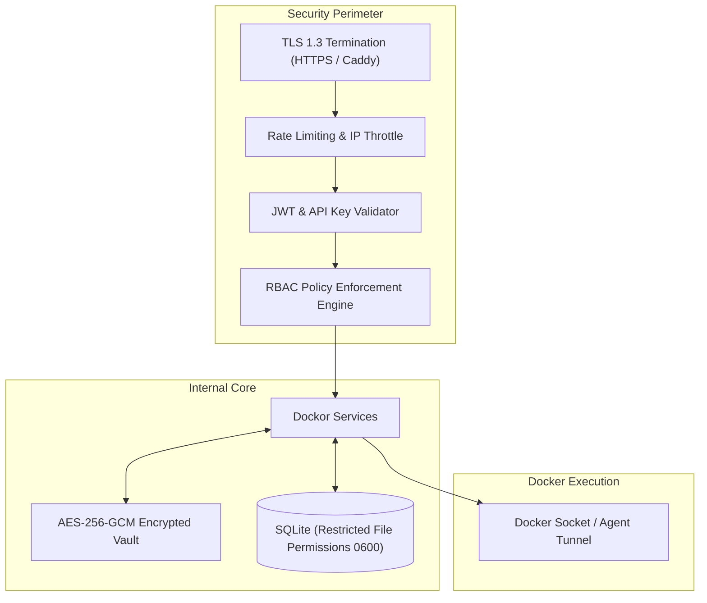

# Deployment & Security Model

## 1. Deployment Architecture

Dockor is designed for zero-friction setup. It can be deployed as a single Docker container, as a standalone native binary, or orchestrated alongside the integrated reverse proxy engine.

### 1.1 Quick Start (Single Docker Container)

To run Dockor managing the local Docker daemon:

```bash
docker run -d \
  --name dockor \
  --restart unless-stopped \
  -p 9000:9000 \
  -v /var/run/docker.sock:/var/run/docker.sock \
  -v dockor_data:/app/data \
  dockor/dockor:latest
```

The web dashboard is instantly accessible at `http://localhost:9000`.

---

### 1.2 Production Deployment with Integrated Caddy Reverse Proxy

For production setups requiring automated public HTTPS:

```yaml
version: "3.8"

services:
  dockor:
    image: dockor/dockor:latest
    restart: unless-stopped
    ports:
      - "80:80"
      - "443:443"
      - "9000:9000"
    environment:
      - DOCKOR_DOMAIN=dockor.example.com
      - DOCKOR_DATA_DIR=/app/data
      - DOCKOR_PROXY_ENABLED=true
      - DOCKOR_LETSENCRYPT_EMAIL=admin@example.com
    volumes:
      - /var/run/docker.sock:/var/run/docker.sock
      - dockor_data:/app/data
      - caddy_data:/app/data/caddy

volumes:
  dockor_data:
  caddy_data:
```

---

## 2. Security Architecture



### 2.1 Encryption at Rest (Secret Vault)
- Sensitive variables in templates (e.g., database passwords, API tokens, Git private keys) are encrypted before persisting to SQLite using **AES-256-GCM**.
- The encryption key is derived from a master secret (`DOCKOR_SECRET_KEY`) using `Argon2id` key derivation.
- When exporting stacks, secret fields can be stripped or masked automatically.

### 2.2 Docker Socket Protection
Interacting with `/var/run/docker.sock` provides root-equivalent host access. Dockor implements strict safeguards:
- **No Direct Socket Passthrough**: Clients never directly query the Docker socket. All calls pass through validated Go service interfaces.
- **Rootless Docker Support**: Dockor can connect to rootless Docker daemons (`unix:///run/user/1000/docker.sock`) without requiring root privileges.
- **Input Sanitization**: Container names, volume paths, and command inputs are strictly validated against path traversal attacks.

---

## 3. Role-Based Access Control (RBAC)

Dockor includes a granular authorization model supporting three core roles:

| Action / Resource | Admin | Developer | Viewer |
| :--- | :---: | :---: | :---: |
| **Manage Users & RBAC** | ✅ Full | ❌ Denied | ❌ Denied |
| **Manage Template Catalogs** | ✅ Full | ❌ Read Only | ❌ Read Only |
| **Deploy Stacks from Templates** | ✅ Full | ✅ Allowed | ❌ Denied |
| **Edit Compose YAML Directly** | ✅ Full | ✅ Allowed (if permitted) | ❌ Denied |
| **Start / Stop / Restart Containers** | ✅ Full | ✅ Allowed | ❌ Denied |
| **Delete Stacks & Volumes** | ✅ Full | ❌ Denied | ❌ Denied |
| **View Real-Time Logs & Stats** | ✅ Full | ✅ Allowed | ✅ Allowed |
| **Attach Interactive Terminal (Exec)** | ✅ Full | ✅ Allowed | ❌ Denied |
| **Add / Delete Nodes & Agents** | ✅ Full | ❌ Denied | ❌ Denied |
| **Generate CI/CD Webhook Tokens** | ✅ Full | ✅ Allowed | ❌ Denied |

---

## 4. Reverse Proxy & Automated SSL Integration

Dockor incorporates an embedded **Caddy engine** to manage domain routing and SSL certificates:

1. **Automatic Certificate Management**:
   - Manages certificates via Let's Encrypt and ZeroSSL using ACME HTTP-01 and TLS-ALPN-01 challenges.
   - Automatically renews certificates in the background before expiration.
2. **Dynamic In-Memory Routing**:
   - When a stack specifies a public domain (e.g., `cloud.example.com`), Dockor instructs the proxy engine via internal API to bind the route without requiring a daemon restart.
3. **Websocket & HTTP/2 Support**:
   - All reverse-proxied routes automatically support HTTP/2, HTTP/3 (QUIC), and transparent WebSocket proxying for modern web applications.
