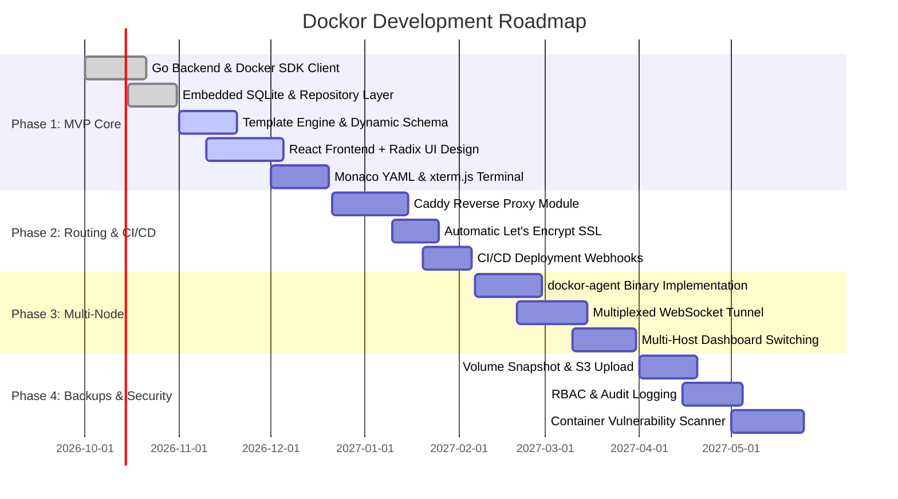

# Features, Competitive Differentiation & Strategic Roadmap

## 1. Executive Summary & Value Proposition

**Dockor** is designed to fill a major gap in the container management ecosystem: providing the simplicity and powerful template cataloging of modern application stores, combined with the technical depth, Compose compatibility, and multi-node power expected by DevOps teams and power users.

By building on **Go** and an unopinionated **React + Radix UI** frontend, Dockor delivers near-instant page loads, zero runtime dependencies, low memory utilization, and a native developer experience.

---

## 2. Competitive Feature Matrix

| Feature | Dockor | Portainer CE | Dockge | CasaOS / ZimaOS | Coolify |
| :--- | :---: | :---: | :---: | :---: | :---: |
| **Backend Tech** | **Go (Pure, Static)** | Go | Node.js | Go | PHP / Laravel |
| **Frontend Tech** | **React 19 + Radix UI** | AngularJS / React | Vue.js | Vue.js | Svelte |
| **Single Binary / Zero DB Setup** | ✅ (Embedded SQLite) | ⚠️ (Custom Boltdb) | ❌ (Node.js engine) | ❌ (Multiple daemons)| ❌ (Requires Postgres/Redis) |
| **Dynamic Form Templates** | ✅ (Native Schema & Types) | ⚠️ (Static JSON forms)| ❌ (Raw compose only) | ✅ (App Store schema)| ⚠️ (Nixpacks/PaaS focus) |
| **Auto-Secret Generation** | ✅ (Cryptographic random) | ❌ (Manual input) | ❌ | ❌ | ✅ (Pre-filled strings) |
| **Auto-Port Conflict Resolution** | ✅ (Detects & shifts port) | ❌ (Deploy fails) | ❌ | ⚠️ (Limited) | ❌ |
| **Portainer v2 Template Import** | ✅ (Built-in adapter) | Native | ❌ | ❌ | ❌ |
| **Interactive YAML Editor** | ✅ (Monaco + Sync) | ⚠️ (Basic editor) | ✅ (Interactive) | ❌ | ✅ |
| **Integrated Reverse Proxy & SSL**| ✅ (Embedded Caddy module) | ❌ (Manual setup) | ❌ | ⚠️ (Basic port proxy)| ✅ (Traefik integrated) |
| **Zero-Inbound Remote Agent** | ✅ (Outbound WS Tunnel) | ⚠️ (Edge Agent setup) | ❌ (Single host only) | ❌ (Single host) | ⚠️ (SSH-based) |
| **CI/CD Webhook Redeploy** | ✅ (Per-stack endpoints) | ✅ | ❌ | ❌ | ✅ (Git webhook) |
| **Licensing** | **Apache 2.0 / MIT** | zlib / Business | MIT | Apache 2.0 | Apache 2.0 |

---

## 3. Core Feature Pillars

### 3.1 Next-Generation Template Engine
- **Rich Parameter Declarations**: Supports types like `port`, `secret`, `volume_path`, `domain`, `select`, and `boolean`.
- **Port Collision Prevention**: Verifies available host ports in real time and automatically re-assigns conflicting ports before deployment.
- **Composable App Stacks**: Declaratively attach companion services (e.g., adding an external Redis cache or MariaDB instance) with simple toggles.
- **Git Catalog Synchronization**: Sync from GitHub, GitLab, or private Git servers using SSH or personal access tokens.

### 3.2 Operator Experience (DevOps & Homelab)
- **Monaco Compose Editor**: Full autocomplete for `docker-compose.yml` keys with inline schema error validation.
- **Split-View Visualizer**: Edit either the dynamic UI form or the raw Compose YAML, with immediate two-way synchronization.
- **Web Terminal**: xterm.js powered interactive terminal directly inside any running container.
- **Real-Time Telemetry**: Real-time graphs for CPU, RAM, Network I/O, and Storage without installing heavy monitoring sidecars.

### 3.3 Seamless Domain & SSL Automation
- **Integrated Reverse Proxy Engine**: Uses embedded Caddy or Traefik to manage incoming HTTP/HTTPS traffic.
- **Zero-Touch Let's Encrypt**: Enable domain routing and automatic HTTPS with a single checkbox in the template setup wizard.
- **Local TLD & Wildcard Support**: Native routing for `.local` or custom development domains.

### 3.4 Multi-Host Orchestration
- **Single-Command Agent Provisioning**: Connect remote VPS or local servers via `dockor-agent`.
- **Firewall & NAT Friendly**: Uses outbound WebSocket tunnels; remote servers do not require public IP addresses or open inbound ports.

---

## 4. Phased Development Roadmap

### Milestone Deliverables

#### Phase 1: Core Foundation (MVP)
- Single-node Docker host management.
- Dynamic template schema engine (`dockor.yaml` + `docker-compose.yml`).
- Automatic port conflict detection.
- Portainer v2 catalog import adapter.
- Embedded pure-Go SQLite store (`modernc.org/sqlite`).
- Web terminal (`xterm.js`) & real-time stats streaming.
- Monaco YAML editor.

#### Phase 2: Routing & CI/CD Automation
- Embedded Caddy reverse proxy module.
- Automated Let's Encrypt SSL certificate provisioning.
- Per-stack CI/CD deploy webhooks.
- Template version comparison & migration helper.

#### Phase 3: Multi-Node Architecture
- Standalone `dockor-agent` Go binary.
- Reverse WebSocket multiplexed tunnel.
- Centralized multi-host dashboard.
- Node health alerts and disconnected state recovery.

#### Phase 4: Data Protection & Security
- Volume backup and restore (Local disk & S3/MinIO destinations).
- RBAC permissions (Admin, Developer, Viewer roles).
- Audit event logging.
- Container image vulnerability scanning (Trivy integration).
