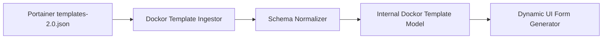

# Dockor Template Specification

## 1. Overview

The **Dockor Template Specification** defines how multi-container application stacks, dynamic configuration schemas, user input fields, and routing rules are declared.

Dockor supports two declaration styles:
1. **Sidecar Manifest (`dockor.yaml`)**: Recommended for templates distributed in Git catalogs alongside a standard `docker-compose.yml`.
2. **Embedded Extension (`x-dockor`)**: Placed directly inside standard Docker Compose files for single-file portability.
3. **Portainer v2 Compatibility Layer**: Automated parser that translates legacy Portainer `templates-2.0.json` into Dockor templates.

---

## 2. Template Structure

A canonical Dockor template package in a Git catalog is organized as follows:

```
templates/
  nextcloud/
    dockor.yaml           # Metadata, variables schema, and UI form configuration
    docker-compose.yml    # Standard Compose file referencing Dockor template variables
    icon.svg              # High-resolution vector icon
    README.md             # Rich documentation rendered in the template catalog modal
```

---

## 3. Specification Schema (`dockor.yaml`)

```yaml
version: "1.0"
metadata:
  id: "nextcloud-stack"
  name: "Nextcloud Hub"
  version: "28.0.4"
  description: "Productivity platform for files, chat, calendar, and collaborative office."
  category: "Productivity"
  tags: ["cloud", "storage", "collaboration", "office"]
  author: "Dockor Community"
  icon: "./icon.svg"
  website: "https://nextcloud.com"
  documentation: "https://docs.nextcloud.com"
  min_dockor_version: "0.1.0"

# Dynamic Variable Schema for Form Generation
variables:
  - name: APP_PORT
    label: "Web Interface Port"
    type: "port"
    default: 8080
    required: true
    description: "External host port exposed for Nextcloud HTTP traffic."
    port_config:
      protocol: "tcp"
      auto_resolve_conflict: true

  - name: DOMAIN_NAME
    label: "Public Domain"
    type: "domain"
    required: false
    description: "Custom domain for built-in HTTPS routing (e.g., cloud.example.com)."
    routing:
      enabled: true
      target_service: "app"
      target_port: 80
      ssl: "letsencrypt"

  - name: MYSQL_ROOT_PASSWORD
    label: "Database Root Password"
    type: "secret"
    generator: "random_string(32, charset=alphanumeric)"
    required: true
    hidden: true
    description: "Master administrative password for the MariaDB database."

  - name: MYSQL_DATABASE
    label: "Database Name"
    type: "string"
    default: "nextcloud"
    required: true

  - name: MYSQL_USER
    label: "Database User"
    type: "string"
    default: "nextcloud"
    required: true

  - name: MYSQL_PASSWORD
    label: "Database User Password"
    type: "secret"
    generator: "random_string(24, charset=alphanumeric)"
    required: true
    hidden: true

  - name: DATA_PATH
    label: "Storage Mount Directory"
    type: "volume_path"
    default: "nextcloud_data"
    required: true
    description: "Named volume or host path where uploaded documents will be stored."

# Life-cycle and Health Hooks
lifecycle:
  healthcheck:
    service: "app"
    http_path: "/status.php"
    expected_status: 200
    timeout_seconds: 60
  post_deploy_instructions: |
    Nextcloud has been initialized. Navigate to your exposed port or domain
    and complete the administrative setup wizard.
```

---

## 4. Associated Compose File (`docker-compose.yml`)

The template engine substitutes `{{ .VARIABLE_NAME }}` or standard `${VARIABLE_NAME}` tokens during deployment:

```yaml
version: "3.8"

services:
  db:
    image: mariadb:10.11
    restart: unless-stopped
    command: --transaction-isolation=READ-COMMITTED --binlog-format=ROW
    volumes:
      - db_data:/var/lib/mysql
    environment:
      - MYSQL_ROOT_PASSWORD={{ .MYSQL_ROOT_PASSWORD }}
      - MYSQL_DATABASE={{ .MYSQL_DATABASE }}
      - MYSQL_USER={{ .MYSQL_USER }}
      - MYSQL_PASSWORD={{ .MYSQL_PASSWORD }}

  app:
    image: nextcloud:28-apache
    restart: unless-stopped
    ports:
      - "{{ .APP_PORT }}:80"
    volumes:
      - {{ .DATA_PATH }}:/var/www/html
    environment:
      - MYSQL_HOST=db
      - MYSQL_DATABASE={{ .MYSQL_DATABASE }}
      - MYSQL_USER={{ .MYSQL_USER }}
      - MYSQL_PASSWORD={{ .MYSQL_PASSWORD }}
    depends_on:
      - db

volumes:
  db_data:
  nextcloud_data:
```

---

## 5. Variable Field Types & Generators

Dockor's template engine parses variable types into rich, interactive form controls on the frontend:

| Type | UI Control Rendered | Special Properties |
| :--- | :--- | :--- |
| `string` | Text Input | `pattern` (Regex validation), `min_length`, `max_length`. |
| `number` | Numeric Input with Stepper | `min`, `max`, `step`. |
| `boolean` | Toggle Switch | Defaults to `true` or `false`. |
| `select` | Dropdown Select | `options: [{ label: string, value: string }]`. |
| `secret` | Masked Input with Regenerate Button | `generator`: `random_string(length, charset)`, `uuid`, `hex(bytes)`. |
| `port` | Numeric Port Input with Conflict Indicator | `auto_resolve_conflict: true`: Automatically increments if port is bound on host. |
| `domain` | Domain Input with SSL selector | Integrates with Caddy/Traefik reverse proxy engine. |
| `volume_path`| Path Picker / Volume Selector | Allows choosing an existing Docker volume or absolute host path. |

### 5.1 Secret Generator Functions

The template parser in Go natively evaluates the following secret generators:
- `random_string(length, [charset])`: Generates cryptographic random strings. Supported charsets: `alphanumeric`, `base64`, `ascii_printable`, `symbols`.
- `hex(bytes)`: Generates a hexadecimal string (e.g., `hex(32)` yields a 64-character hash).
- `uuid`: Generates a standard RFC 4122 UUID v4.

---

## 6. Port Conflict Detection & Dynamic Resolution

Before deploying a template, the Dockor engine scans the host node:
1. Queries all active container port mappings via Docker Engine API (`/containers/json`).
2. Checks local socket bindings (`net.Listen("tcp", ":port")`) on the target host.
3. If `auto_resolve_conflict: true` is configured and the default port (e.g. `8080`) is occupied:
   - The engine searches sequentially upwards (`8081`, `8082`, ...) for the next available port.
   - The UI displays an alert badge: *"Port 8080 was busy; auto-assigned port 8081"*.

---

## 7. Portainer v2 Compatibility Layer

Dockor includes an ingestion adapter for Portainer v2 template catalogs:



### Transformation Rules:
- Portainer `type: 1` (Container) is automatically wrapped into a single-service Docker Compose structure.
- Portainer `type: 2` (Stack / Compose) is parsed directly from the linked Git repository or raw Compose string.
- Portainer `env` variables (with `name`, `label`, `default`, `preset`) are converted to `Dockor.variables` with type inference:
  - If a variable default contains password-like tokens, it is marked as `type: secret`.
  - Port declarations in the compose file without explicit variables are automatically surfaced as dynamic `type: port` inputs.
